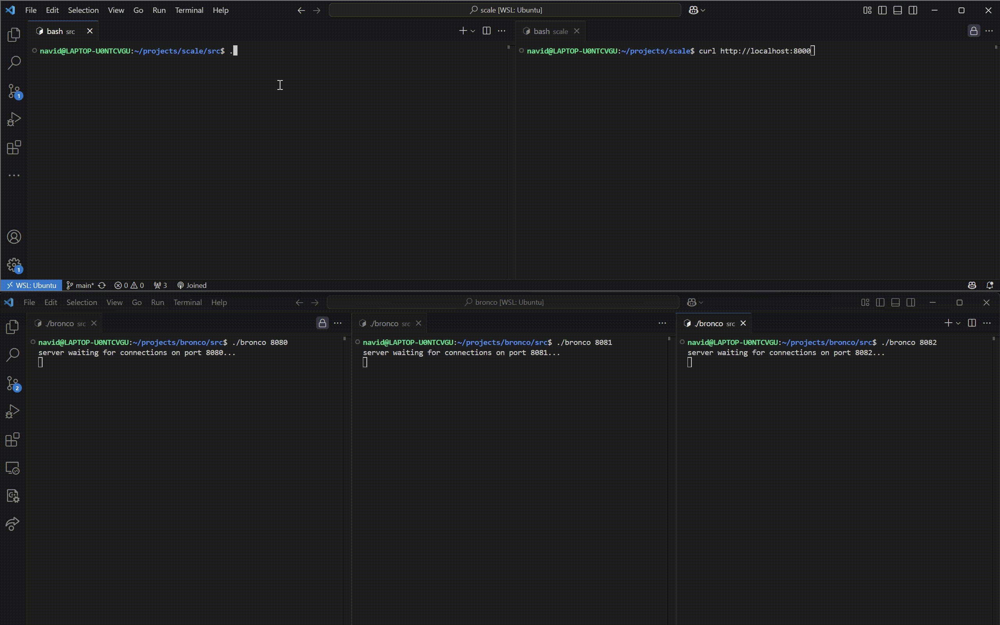

# Scale: Load Balancer

Scale is a layer 4 load balancer written in C.

## Demo

## How it works

Scale works a reverse proxy, rerouting traffic evenly among the backend servers provided to it. 
- Implemented using the Round Robin or Least Connections algorithm
- Ensures backend servers can fail gracefully with periodic health checks that will temporarily remove innactive servers from the rotation
- Multithreaded so multiple requests can be handled concurrently

## How to use it

### Prerequisites

- Unix system

### Running the application

1. Navigate to the `src` directory
2. Run `make` 
3. Run `./scale [port number]`
